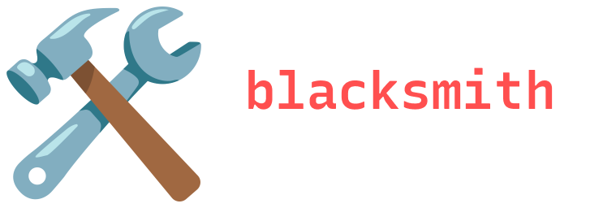

This framework is under development and is an early alpha release, it is currently **not recommended** to use in production.

# Table of Contents
1. [Quickstart](#quickstart)
    - [Configuration](#configuration)
2. [Usage](#usage)
    - [Conversation](#conversation)
    - [Classification](#classification)
    - [Schema Guided Generation](#schema-guided-generation)
    - [Banning Words and Phrases](#banning-words-and-phrases)
3. [Function Calls](#function-calls)
    - [Creating Functions](#creating-functions)
    - [Executing Function Calls](#executing-function-calls)
4. [Advanced Usage](#advanced-usage)
    - [Context Manager](#context-manager)
    - [Completion Hooks](#completion-hooks)
5. [Contributing (coming soon!)]()
6. [Roadmap](#roadmap)

# Quickstart

### Configuration
Set the default configuration for LLM calls.

```python
from blacksmith.context import Config

cfg = Config(
    model="gpt-4-0613",
    temperature=0.1,
    api_key="sk-XXXXXXXXXXXXXXXXXXXXXXXX",
)
```

```python
from blacksmith.llm import Conversation

c = Conversation()

response = c.ask("What is the meaning of life?")
```


# Usage

### Conversation

We can make requests to a `Conversation`, which represents a chain of messages to a LLM.

```python
from blacksmith.llm import Conversation

c = Conversation()

res = c.ask("Give me an Asian dessert themed name for my Maltese puppy.")

print(res.content)
"""
Mochi
"""

res = c.ask("What is that in Mandarin Chinese?")

print(res.content)
"""
In Mandarin Chinese, Mochi would be 麻糬 (máshǔ).
"""
```

### Classification
We can use the `Choice` class to reduce the completion between multiple possibilities.

```python
from blacksmith.llm import Choice, generate_from

cities = Choice(options=["San Francisco", "Los Angeles", "New York City"])
print(generate_from(cities, "The Golden Gate Bridge"))
"""
San Francisco
"""

numbers = Choice(options=[1, 25, 50, 100])
print(generate_from(numbers, "A number greater than 75"))
"""
100
"""

fruits = Choice(options=["Strawberry", "Banana", "Blueberry"])
print(generate_from(fruits, "A red colored fruit"))
"""
Strawberry
"""
```

### Schema Guided Generation
We can generate a JSON mapping to a custom `Schema`.

```python
from blacksmith.llm import Schema, generate_from
from enum import Enum


class City(str, Enum):
    SF = "San Francisco"
    LA = "Los Angeles"
    NYC = "New York City"


class School(str, Enum):
    CAL = "UC Berkeley"
    STANFORD = "Stanford"
    UCLA = "UCLA"


class Character(Schema):
    name: str
    age: int
    school: School
    city: City

print(
    generate_from(Character, "John just graduated from UC Berkeley and lives near Golden Gate Park in SF")
)
"""
{'name': 'John', 'age': 22, 'school': 'UC Berkeley', 'city': 'San Francisco'}
"""
```

### Banning Words and Phrases

We can ban words or phrases from appearing in our output.

```python
from blacksmith.llm import Conversation

c = Conversation()

res = c.ask("Name 5 cities in California")
print(res.content)
"""
1. Los Angeles
2. San Francisco
3. San Diego
4. Sacramento
5. San Jose
"""

# We have to be careful when using phrases as an input - any words prefixed with the token 'San' and 'Los' are also removed from the output.
# A better approach would be to just remove 'Francisco' and 'Angeles'
c.ban_word("San Francisco")
c.ban_word("Los Angeles")

res = c.ask("Name 5 cities in California")
print(res.content)
"""
1. Sacramento
2. Fresno
3. Oakland
4. Santa Barbara
5. Long Beach
"""
```


# Function Calls

### Creating functions
We can create functions for our LLM to call using the `tool` decorator.

```python
from blacksmith.tools import tool

@tool(
    name="foo",
    description="A function that returns the parameter passed to it",
    params={"bar": "The return value"},
)
def foo(bar: str):
    return bar
```

### Executing function calls

We can execute function calls from the result of `ask`.

```python
from blacksmith.tools import tool
from blacksmith.llm import Conversation


@tool(
    name="Multiply",
    description="A function that returns the result of the first argument multiplied by the second argument",
    params={"a": "The first number", "b": "The second number"},
)
def multiply(a: int, b: int):
    return a * b


c = Conversation()
resp = c.ask("What is 5 * 10")

if resp.has_function_call():
    # We can inspect the function call if we want
    resp.function_call.inspect()
    """
    {
        "tool": "Multiply",
        "args": {
            "a": 5,
            "b": 10
        }
    }
    """

    # Looks good!
    result = resp.execute_function_call()

    # We can inspect the result if we want
    result.inspect()
    """
    {
        "tool": "Multiply",
        "args": {
            "a": 5,
            "b": 10
        },
        "result": 50
    }
    """
    resp = c.continue_from_result(result, stop=True)

# Final answer
print(resp.content)
"""
50
"""
```

# Advanced Usage

### Context Manager
We can use the context manager to execute code blocks with an arbitrary configuration.

```python
from blacksmith.context import model

c = Conversation()

with model("gpt-4-0613", 0.5):
    # Executed with "gpt-4-0613"
    response = c.ask("What is the plural for octopus?")

with model("gpt-3.5-turbo", 0.5):
    # Executed with "gpt-3.5-turbo"
    response = c.ask("What is the meaning of life?")
```

You can also explicitly specify a configuration for a `Conversation`.

```python
from blacksmith.context import Config
from blacksmith.llm import Conversation

# When initializing a Conversation
cfg = Config(
    model="gpt-3.5-turbo",
    temperature=0.5,
)
c = Conversation(config=cfg)

# Use the `with_config` method to set or replace a configuration for a
# Conversation at any point in its lifecycle.
new_cfg = Config(
    model="gpt-4-0613",
    temperature=0.1,
)
c.with_config(new_cfg)
```


### Completion hooks

We can define custom functions to run on the `Completion` object.

This is useful if you need observability on the raw model output.

```python
from blacksmith.llm import Conversation
from blacksmith.context import Config

# Let's print the token usage
print_usage = lambda c: print(c.usage)

# We can initialize `Config` objects with completion hooks
cfg = Config(
    model="gpt-3.5-turbo",
    temperature=1,
    api_key="sk-XXXXXXXXXXXXXXXXXXXXXXXX",
    on_completion=[print_usage],
)

# Pass in the configuration
c = Conversation(config=cfg)

res = c.ask("What is cascara?")
"""
    {
        "prompt_tokens": 12,
        "completion_tokens": 117,
        "total_tokens": 129
    }
"""

print(res.content)
"""
Cascara is a beverage made from the dried husks of the coffee cherry fruit.
It is derived from the outer skin and pulp of coffee cherries that are typically discarded during the coffee bean harvesting process. The word "cascara" means "husk" or "shell" in Spanish. 
The dried husks are brewed to create a tea-like beverage that has a fruity flavor with notes of cherry, raisin, and hibiscus.
Cascara is becoming increasingly popular as an alternative to traditional coffee or tea, offering a unique taste profile and potential health benefits.
"""
```

We can also add completion hooks on a `Conversation` level.

This is useful if we are using a single configuration for many conversations and want granularity on hook implementations.

```python
from blacksmith.llm import Conversation

# Let's print the token usage
print_usage = lambda c: print(c.usage)

c = Conversation()

# We can also use the `on_completion` method to add hooks to a conversation.
c.on_completion(print_usage)

res = c.ask("What national parks are located in California?")
"""
    {
        "prompt_tokens": 15,
        "completion_tokens": 95,
        "total_tokens": 110
    }
"""

print(res.content)
"""
There are nine national parks located in California:

1. Death Valley National Park
2. Joshua Tree National Park
3. Channel Islands National Park
4. Sequoia and Kings Canyon National Parks (jointly managed)
5. Lassen Volcanic National Park
6. Redwood National and State Parks (jointly managed with the State of California)
7. Point Reyes National Seashore
8. Pinnacles National Park
9. Yosemite National Park
"""
```

# Roadmap

- [ ] Embeddings
- [ ] Fine-tuning
- [ ] Prompts
- [ ] Agents